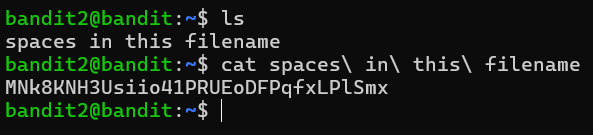
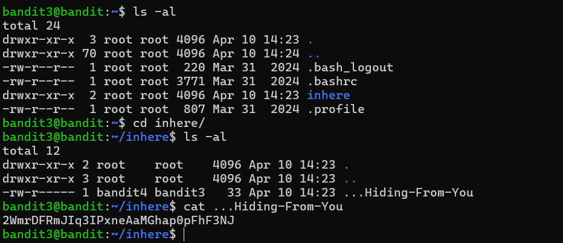
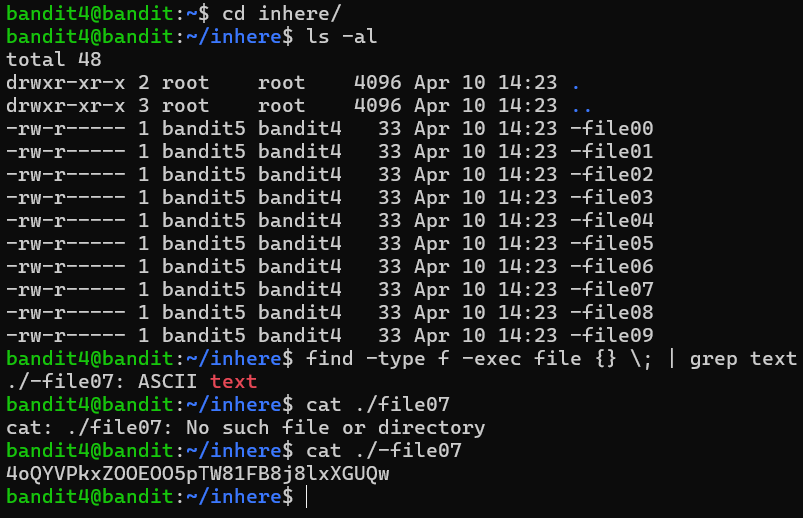
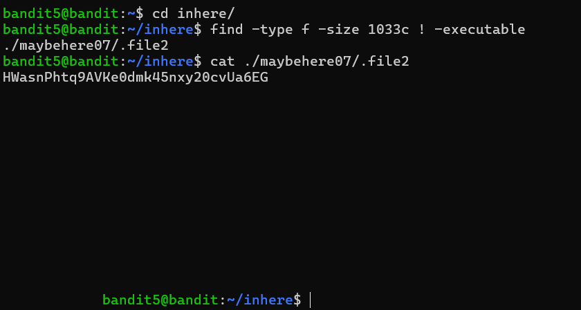
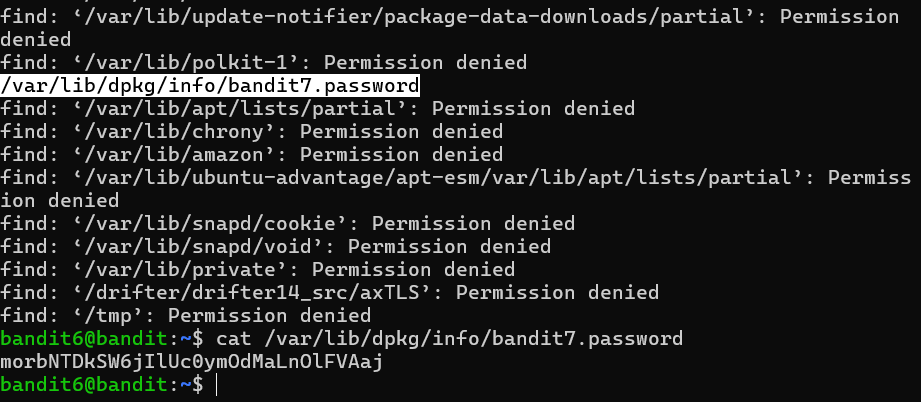
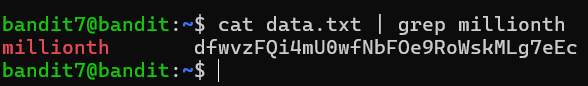
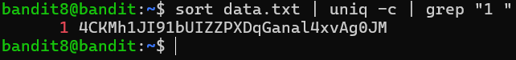

# Level 0

Using **ssh** command to connect to the server with the user **bandit0** over **port 2220**.

```console
$ ssh -p 2220 bandit0@bandit.labs.overthewire.org
```

The password is **bandit0**.

# Level 1

The command

```console
$ ls
```

gives us the files in the current directory. It prints out that there is a file named **readme**. Using

```console
$ cat readme
```

command, we get what that file holds inside.


The password is **ZjLjTmM6FvvyRnrb2rfNWOZOTa6ip5If**

# Level 2

We have a file named ' - ' . If we do

```console
$ cat -
```

it won't work because it's expecting standard input as the dashes are reserved for the parameters. What we can do is

```console
$ cat ./-
```

The ' . ' means current directory. Doing so, we are providing the path for the file we want to cat.


The password is **263JGJPfgU6LtdEvgfWU1XP5yac29mFx**

# Level 3

Spaces are special characters that can be used for other things not like the standard alphanumerical characters. To make the machine understand that our intention with spaces is the actual visible space, we write before them a backslash ' \\ ' .

```console
$ cat spaces\ in\ this\ filename
```



The password is **MNk8KNH3Usiio41PRUEoDFPqfxLPlSmx**

# Level 4

We have a folder called **inhere** that contains the password file. So we need to change our directory to it with the following command

```console
$ cd inheare/
```

The hint says that the file is hidden. Hidden files are the ones that their names start with " . " and to see them we use the command

```console
$ ls -al
```

The parametre **-a** is enough to do the job but I like to list my files each on its own line so I add the parameter **-l**.



The password is **2WmrDFRmJIq3IPxneAaMGhap0pFhF3NJ**

# Level 5

The hint says that the targeted file is the only human-readable file in **inheare/** folder that means that when we proceed **file** command on it, we get **ASCII text**.
So the trick is to run that command recursivly on all the files and grab the one that outputs **ASCII text**.

```console
$ cd inheare/
$ find -type f -exec file {} \; | grep text
$ cat ./-file07
```

Okay let's break that command down:

- " **find -type f -exec file {} \\;** " is responsible of listing the type of each file :
  - **find** is the command to find files or directories based on filters.
  - **-type** parameter filter the type. Since we're looking for files we put **f**.
  - **-exec** execute a seperate command on each found file.
    - **file** is the command.
    - **{}** is the argument placeholder : for each file treated, **{}** gets replaced with the file name.
    - " **\\;** " marks the end of the command. We wrote **\\** because -like we stated earlier- " **;** " is a special character and shell would recognize it as a sperator and reads the rest of the line as another command.
- " **| grep text** " filter the results to output only the ASCII file :
  - " **|** " pipes the output of the left part to the input of the right path. So basically we get the results of the previous job and set it as the input of the **grep** command.
  - **grep** shows specific parts of a text based on patterns and filterings we provide to it.
  - **text** is the filtering we are doing since we're only looking for files that output " **ASCII text** " as a result.



The password is **4oQYVPkxZOOEOO5pTW81FB8j8lxXGUQw**

# Level 6

The hint says that the targeted file is the only human-readable file in **inheare/** folder that means that when we proceed **file** command on it, we get **ASCII text**.
So the trick is to run that command recursivly on all the files and grab the one that outputs **ASCII text**.

```console
$ cd inheare/
$ find -type f -exec file {} \; | grep text
$ cat ./-file07
```

Okay let's break that command down:

- " **find -type f -exec file {} \\;** " is responsible of listing the type of each file :
  - **find** is the command to find files or directories based on filters.
  - **-type** parameter filter the type. Since we're looking for files we put **f**.
  - **-exec** execute a seperate command on each found file.
    - **file** is the command.
    - **{}** is the argument placeholder : for each file treated, **{}** gets replaced with the file name.
    - " **\\;** " marks the end of the command. We wrote **\\** because -like we stated earlier- " **;** " is a special character and shell would recognize it as a sperator and reads the rest of the line as another command.
- " **| grep text** " filter the results to output only the ASCII file :
  - " **|** " pipes the output of the left part to the input of the right path. So basically we get the results of the previous job and set it as the input of the **grep** command.
  - **grep** shows specific parts of a text based on patterns and filterings we provide to it.
  - **text** is the filtering we are doing since we're only looking for files that output " **ASCII text** " as a result.


The password is **4oQYVPkxZOOEOO5pTW81FB8j8lxXGUQw**

# Level 6

It is a file so **-type f**, has a size of 1033 byte so **-size 1033c** (**c** stands for byte), **not** executable so **! -executbale**.

```console
$ cd inheare/
$ find -type f -size 1033c ! -executable
$ cat ./maybehere07/.file2
```



The password is **HWasnPhtq9AVKe0dmk45nxy20cvUa6EG**

# Level 7

The hints says that the file is somewhere in the server so we search in " **/** " directory which represents the very root of the server. We filter the **-user bandit7**, the **-group bandit6** and the **-size 33c**.

```console
$ find / -user bandit7 -group bandit6 -size 33c -type f
```



As we can see, the file is located in **/var/lib/dpkg/info/** under the name **bandit7.password**.

The password is **morbNTDkSW6jIlUc0ymOdMaLnOlFVAaj**

# Level 8

We simply cat the content and grep the keyword **millionth**.

```console
$ cat data.txt | grep millionth
```



The password is **dfwvzFQi4mU0wfNbFOe9RoWskMLg7eEc**

# Level 9

When we talk about occurence, what comes to mind is **sorting**, **minimizing** then **filtering**.

```console
$ sort data.txt | uniq -c | grep "1 "
```

- **sort** sorts the lines in the file alphabetically.
- **uniq** minimize adjacent identical lines and replace them with one instance. We add **-c** parameter to prefix each line the count of its original occurence.
- **grep "1 "** greps the line that starts with "**1**" which means with one occurence. Don't forget the space in the string after **1** otherwise it will outputs the lines with 10-19 occurence.



The password is **4CKMh1JI91bUIZZPXDqGanal4xvAg0JM**
