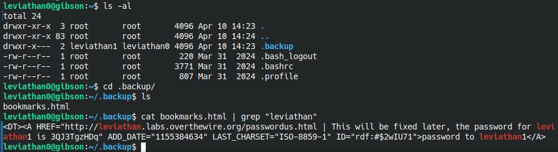

# Level 1

After logging in to **leviathan0**, I found nothing interesting except a **.backup** folder that has a long html file. I tried extarcting the password from **/etc/leviathan_passleviathan1** but no luck due to permission. So I thought maybe the password is saved in that backed up htmll file. I grepped its content looking for **"leviathan"** string match and it printed the password out !

