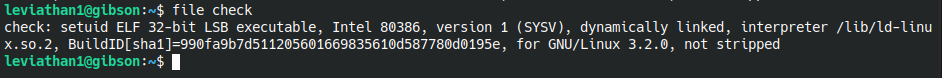
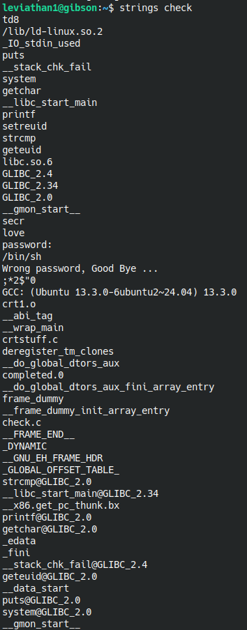
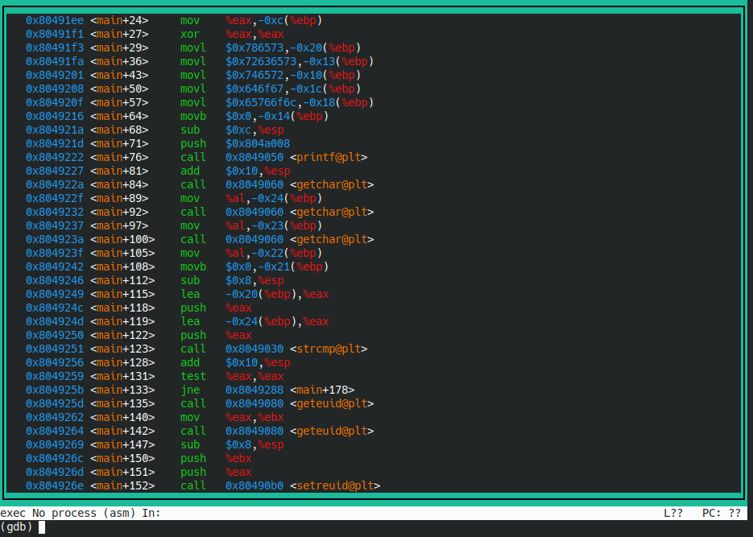
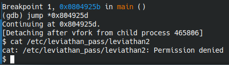
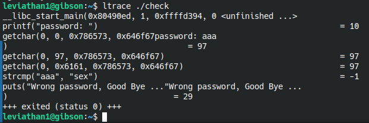
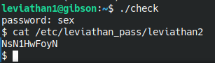

# Level 2

We have a file called **"check"** and running **file** command on it

Revealed that it is a setuid elf binary which means it gets executed with th permission of its owner no matter who executes it.

Running it prompted us to write a password and of course it will be wrong. Obviously, we need to do some reverse engineering here. Since it's the second level, I thought it is too early for **gdb** dirty work so I went **stringing** the binary on the hope of finding the password hardcoded in the binary readable parts.

Among these weird strings, the ones I found unfamiliar are **"td8"**, **"secr"** and **"love"**. I tried them baut with no luck. We can also see the output messages **"password: "** and **"Wrong password, Good Bye ..."** and what got my attention, there is **"/bin/sh"** ?? Humm, maybe if we passed the password check, it will give us shell with the owner permissions so we can cat the content of **/etc/leviathan_pass/leviathan2** ? Anyway.

I thought maybe we need to get this up to real reverse work ? But I need gdb and I went checking if they already have it installed otherwise I'll need to copy the file and work on it locally but luckily they have. Let's type **"gdb check"** and type **"layout asm"** to see what's going on.

Okay it is calling the **getchar** function 3 times successfully so I'm guessing the password is 3 characters long then it called the **strcmp** function to do string comparasion. Right after that, we have **"jne"** operation which jumps to another address if **"not equal"** flag is activated. So, if the string comparaison gave false, the program will jump further in the program to the end of it. What we can do here is setting a break point right before the jumping instruction and skip it by jumping to the instruction that follows it. Let write **"b *0x804925b"** which sets a break point on the address of that instruction and write **"run"** to start the program. Normally, it will ask for a password so let's provide it with anything and then it will stop where we told it to stop. There, let's write **"jump *0x804925d"** to go to the next instruction and not call the jump operation.

And it did indeed gave as a shell. But running cat on the file we need raised permissions error so it didn't work. And I can't see the password anywhere in that assembly mess. So let's write **"exit"** to get out of that shell and **"q"** to exit gdb.

Since reversing is not my strongest ability, I went a step back and ran **"ltrace"** on the program to get readable version of the functions that get called.

And we can see it in plain text that it is comapring to the word **"sex"**. As assumed, a 3 characters word. But I'm wondering why string didn't show it. Anyway, let's run it again and provide the true password.

Sweet !