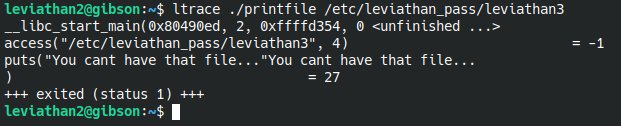
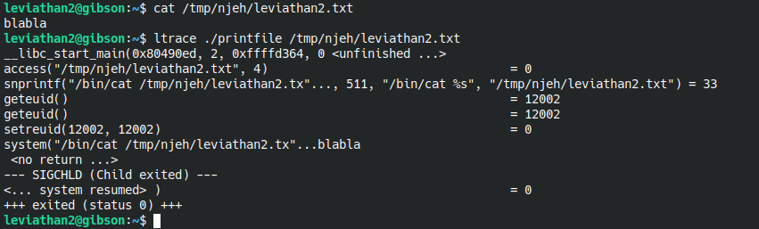
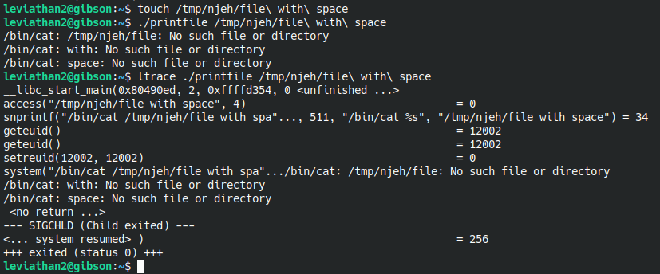
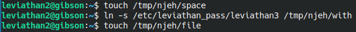
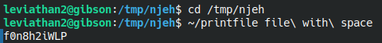

# Level 3

In this level, we have a binary called **printfile** that accepts a file path as an argumant and print it out. But when applying this to **/etc/leviathan_pass/leviathan3**, it tells us we don't have access to that file which is weird because the binary is with setuid so normally we are executing it with **leviathan3** previleges which include reading that file. Anyway, let's **ltrace** it to see what's going on.

Ah now I see why ! 

So there is this C function called **access()** which take two parameters, the first is the file path and the second is the permission seeked. Here, **"4"** refers to **"read"**. But the thing about **access()** is that it checks the real user ID who executed. In our case as **leviathan2** trying to open a file that **leviathan3** is its owner, taht function will revert our attempt opening it.

Let's analyse it more by creating our own file in a **/tmp** directory and opening it with **printfile**.

I have made a file with **"blabla"** as its content. After running **printfile** on it, we see some interesting stuff going on after passing the **access()** check. The one that got my attention is the last one which is the **system()** function. That function executes what's passed in it. The interesting part is that it doesn't take care of spacing in the input. If we have a space in our input, the cat command will read it as 2 sperate files. Let's try it by creating a file that included spaces.

Yes it went looking for files or folders called **"with"** and **"spaces"**.

To take advantage of this, I wanted to craft a file with such a name : **"whatever /etc/leviathan_pass/leviathan3"** but it kept wining about nor finding the directory. So I thought maybe symboling link would work just fine ? lets create a seperate file called **"with"** and link it to **/etc/leviathan_pass/leviathan3"** and when we call the file named **"file with space"**, the file **"with"** will get called. Let's add empty files called **"space"** and **"file"** so it won't throw an error for not finding them.

No let's move to the directory of these files and execute **printfile**.

