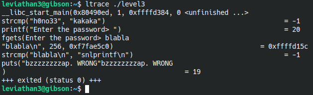

# Level 4

Here we have a binary called **level3** that asks us for a password. Let **ltrace** and see what's going on.

At first it did compare **"h0no33"** with **"kakaka"** which will always give False so I thought we're gonna need to change the logic flow of the program. But proceeding with a random password revelad that it compares with **"snlprintf\n"**. Running the program again and giving that string as the passowrd gave as shell with **leviathan4** previleges which allows us to get the content of **/etc/leviatthan_pass/leviathan4**.