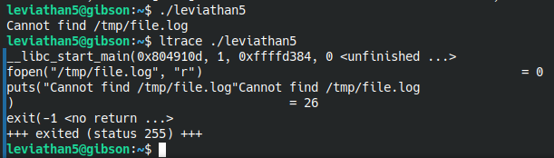
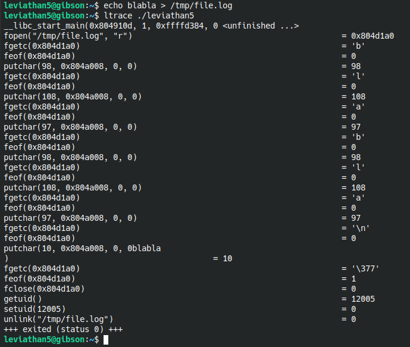
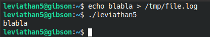
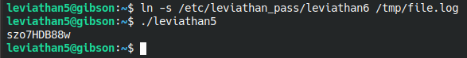

# Level 6

Here, we have a binary called **"leviathan5"** and running it complains about the existance of **"/tmp/file.log"** so let's **ltrace** it and find more about it.

So let's create that file it requires and see what it does after.

So it reads its content character by character then it reads it all ? then it reads our ID and reset it ? and finally delete the file ? Let's repeat the process without **ltrace**. 

Yes, it outputs the content of **/tmp/file.log**.

How about we link that file to **/etc/leviathan_pass/leviatthan6** ?

Nice.
