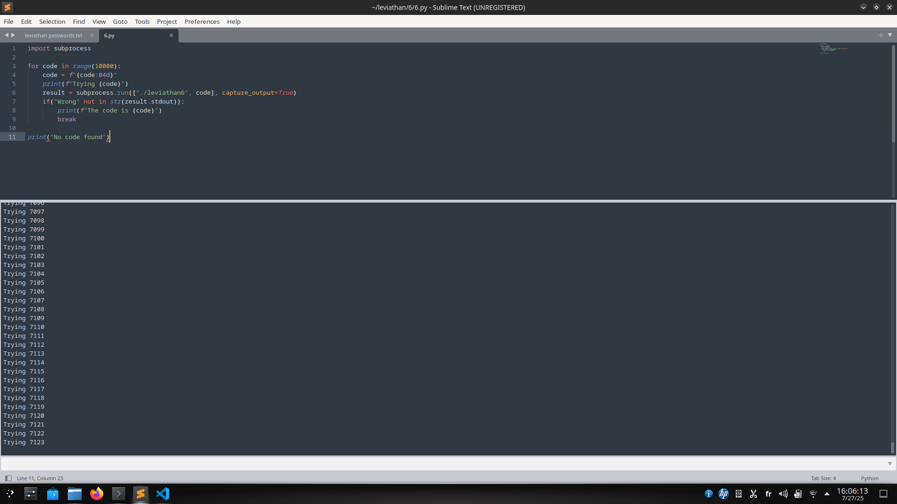

# Level 7

Here we are presented with a binary called **leviathan6** that requires a code of 4 digits as an argument. When we git it a random one it outputs "Wrong!". So we need to guess the right code. Trying **strings** and **ltrace** commands gave no clue so let's get our hands dirty and brutforce the code.

First, let's get the binary to our local machine so we can run a python script on it to bruteforce its code.

```console
$ scp -P 2223 leviathan6@leviathan.labs.overthewire.org:leviathan6 .
```

Now, let's write a python script that runs this program and each time feeds it an argumant from 0000 to 9999 and see if the output contains the string **"Wrong"**

```python
import subprocess

for code in range(10000):
	code = f"{code:04d}"
	print(f"Trying {code}")
	result = subprocess.run(["./leviathan6", code], capture_output=True)
	if("Wrong" not in str(result.stdout)):
		print(f"The code is {code}")
		break

print("No code found")
```



After running, it kept iterating until it stopped on code 7123 without outputting any sign of success or failure. So I manually run the program with that got as an argumant and, surprise surprise, it gave me shell ! 

So let's reconnect to the level and give it the correct code to gain shell that will allow us to cat **/etc/leviathan_pass/leviathan7**